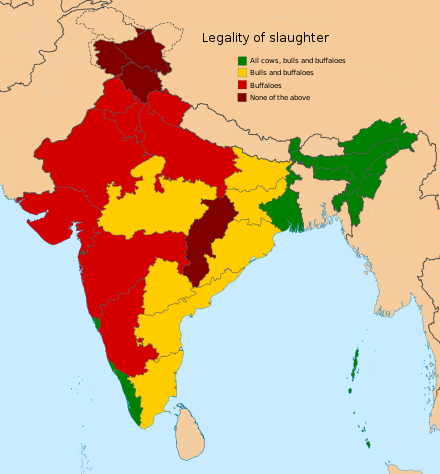

```{r setup, include=FALSE}
knitr::opts_chunk$set(echo = TRUE)
library(readxl)
library(tidyverse)
library(fastDummies)
```
```{r data import}
beef <- read_xlsx('olderbeef.xlsx')
beef$Year <- as.numeric(as.character(beef$Year))
beef <- mutate(beef , lagyear = Year + 20) %>%
  mutate(normcons = (percapconsumption/33.67591811) * 100)


murder <- read_xlsx('murder.xlsx')
murder$Year <- as.numeric(as.character(murder$Year))
murder$murder <- as.numeric(as.character(murder$murder))
murder <-  mutate(murder , normmurder = (murder/5.4) * 100)
```
## Question 1
Begin by collecting national data on annual U.S. beef consumption per capita from 1930 to the present (or something similar to that...the government collects a variety of related statistics) and annual U.S. homicide per capita from 1950 to the present.  Make a graph that plots homicide rates against the 20 year lag of beef consumption. Compute the simple correlation between those two data series. Assuming the relationship is causal, how much could we reduce violent crime if we eliminated all beef consumption?  Does this magnitude seem reasonable or unreasonable?

#### Response
I used boneless beef availability data from the USDA as a proxy for beef consumption in the US. Of the data availability, boneless availability seemed the best proxy as it is closest to what actually ends up on plates and in stomachs in America. I used a combination of data from the FBI Unified Crime Reports and the U.S. Department of Health, Education, and Welfare (now Health and Human Services and Education) for the murder rate. Data from 1950-1960 is from the USHEW, 1960-2019 is from the FBI UCR. 
```{r plot}
ggplot() +
  geom_line(data = beef ,  mapping = aes(x = lagyear , y = normcons , color = 'Beef consumption' )) + 
  geom_line(data = murder , mapping = aes(x = Year , y = normmurder , color = 'Murder rate')) + 
  scale_x_continuous(name = 'Year' , limits = c(1950 , 2019)) + 
  scale_y_continuous(name = 'Normalized value') +
  labs(colour = '' , 
       title = 'U.S. Murder rate and beef consumption' , 
       subtitle = 'Per capita normalized values; beef consumption lagged by 20 years') + theme_minimal()
```
```{r model}
murder <- rename(murder , lagyear = Year)
data <- full_join(x = beef , y = murder, by = 'lagyear') %>%
  filter(Year > 1929)

model <- lm(murder ~ percapconsumption , data)
summary(model)
```

The coefficient on per capita beef boneless availability is 0.0411. This implies that for every one pound of beef that each American consumes, 0.0411 more murders will be committed. This correlation does not seem valid to me, as that is a large number of murders. If this were truly a causal estimate, I alone would be probably responsible for at least one murder (24 pounds of annual consumption) in my lifetime. 
 
```{r total}
model2 <- lm(murder ~ totalconsumption , data)
summary(model2)
```
The coeffiecent on total boneless beef availability is .00003351 ($3.351 \times 10^{-5}$). This implies that for every million pounds of beef made available to Americans, .0000351 murders are committed.

Americans consumed `r 18184.2*1,000,000` pounds of beef in 2019 (from USDA boneless availability reports), which is 55.4 pounds per person. This correlation implies that if we ended beef consumption, we could prevent `r 18184.2*0.00003351` murders. This does not seem very

## Question 2
If instead of national-level data, you had annual, state-level data from 1930-present on beef and homicide, describe how you would analyze it. Be specific. What would your regression look like?  What covariates would you want to include?

### Response

With state-level annual data I would run a regression controlling for state and time effects to use panel data. The use of panel data would control for a number of confounding factors, and allow for a more robust causal conclusion. 

I would regress the murder rate on percent change in lagged, per capita beef consumption by state per year, setting 1930 (lagged to 1950) as the base level. I would include dummy variables for every year and every state to ensure the regression uses panel data and isolates the effect of increased beef consumption. 

In addition to using state and year dummys, I would like to include controls for other major variables that effect crime. Ideally, this would include abortions per year and crack cocaine prevalence. By controlling for these two variables which have a significant effect on crime, the panel data could provide a better causal estimate of the effect of beef consumption on murder.

## Question 3

Imagine you were able to run a randomized experiment, and that you could do whatever you wanted to, subject to a budget of $5 million. you want the experiment to be a good one. Describe the experiment you would run. Explain the choices you make. What are the weaknesses of your randomized experiment?

### Response

I would run an RCT centering on a number of families in a single city. Ideally, I would randomize at the school and zip code level. Randomizing at the school level would help ensure that young people both at home and at school are not being given beef to consume. Schools would be randomly selected to either be beefless or control. At a school that is undergoing treatment, parents would be compensated for giving up beef. We would track the crime rate of students within the whole city and the treatment and control groups to reveal whether beef consumption at a young age increased crime 10-20 years after treatment, when a child ages into a high crime demographic.

If funding allows, all parents involved in the study should be compensated to ensure that the control group remains a valid counterfactual for the treatment group. However, if funding is not great enough to compensate all families, only compensating those in the treatment group would likely lead to a decrease in crime in treated children over those in the control group. Because this biases the result down, however, compensation differences would not invalidate results.

The hypothesis centers on a young person's consumption of beef, but there is no clear indication of a mechanism through which beef consumption would lead to crime. I would want to do more research about potential mechanisms to confirm how long individuals must be treated. Ideally, parents would be enrolled in the study based on their zipcode from the day a child is born, and would prevent beef from being consumed until their child graduates from elementary school. If a mechanism presents itself through prior research that requires a longer treatment, the beefless period in a child's life would have to be extended. 

The most problematic aspect of this experiment would be enforcement. There is no effective method of ensuring the treatment group does not consume beef over the long treatment period. This leaves significant room for the procedure to fail. Additionally, if the study were to only compensate families assigned to treatment (or compensated treated families more than control families), the additional disposable income could be strongly correlated to decreases in crime. This could limit the statistical power of the experiment. 

## Question 4

Now, let’s say you have zero budget. Professor Levitt wants you to find three different natural experiments that might shed light on this question.  Give your three best ideas for possible natural experiments you might be able to exploit. I want these to be real things that you could actually explore. What are the strengths and weaknesses of your natural experiments. 

### Response

1) As a result of various religious and cultural factors, the legality of slaughtering cows varies greatly across India. Exploiting these differences, I would want to either run a panel data regression if annual state murder data is sufficient, or run a Difference-in-Differences regression using legality as the treatment. The laws are quite variable and have changed significantly over time. An example difference-in-differences event could be the 1994 passage of a cattle slaughter ban in Delhi.

This is a strong natural experiment because of this legislation's clear impact and reflection of beef eating habits on a national scale by region. I believe the fixed-effect regression would be more revealing than the DiD, as the passage of legislation that bans cattle-slaughter is likely reflective of cultural and religious factors that imply limited beef consumption both before and after treatment. However, with the number of regions where beef consumption is more common, fixed effects regression could reveal a strong causal effect.

This is a weak natural experiment because it establishes treatment and control groups that are fundamentally different. Because the consumption of beef is a reflection of the cultural and religious situation across India, comparing states which do consume beef to those which don't could allow for the introduction of numerous confounders that are difficult to control for. I am in no way an expert on Indian culture and beef consumption, and have no way of knowing or predicting the potential confounders that might arise as a result of this type of fixed effects regression. Additionally, these laws reflect the legality of slaughtering cattle, not the legality of consuming or importing beef. These laws likely indicate regional beef consumption, but this is inherently linked to other cultural factors. As has become more apparently in recent years, Muslim individuals in India (likely the majority of the beef-eating populations), are systematically discriminated against and have a different political situation than Hindu people.

A differences-in-differences experiment would provide a better specified model and a more legitimate causal assumption. Beef laws in India, however, do not provide for a very effective difference-in-difference experiment. The 1994 law change in Delhi I mentioned earlier was apparently more of a reflection of limited beef consumption and pro-cow beliefs that define Delhi politics. The likelihood that a significant number of young people consumed different amounts of beef before and after this law change is limited. 



2) Bovine Spongiform Encephalopathy, otherwise known as Mad Cow Disease, is an prion-based infectious disease that affects the human brain and is nearly 100% fatal. An individual contracts BSE by consuming infected beef. BSE first rose to prominence and national attention in the UK in the 1980s, causing thousands of cattle to be culled and millions of UK citizens to stop eating beef altogether. The concern over BSE was so great that in 1989 the UK government banned the human consumption of high risk offal.

The generation of children that were born and raised from 1985-1990 in the UK likely consumed significantly less beef as a result of the outbreak. Manipulating this natural variation that arose because of the BSE scare, I would compare the cohort of children in the UK that were born from 1985-1990 (the height of the BSE scare) to the cohort born directly after (1990-1995). 

This is a strong experiment because it capitalizes on natural variation in the diets of people in the UK that specifically targets beef. The people who were likely to avoid beef in the treatment group are very similar to those in the control group. This experiment does not deal with the same cultural differences that make the first natural experiment.

This is a weak experiment because the magnitude of impact of BSE is not very significant. Without a clear mechanism of beef consumption as a child to criminal as an adult, it is difficult to understand whether a relatively short (5-year) shock is long enough to have a causal impact on crime even if beef consumption does effect crime. The tradeoff between this experiment and the first is the size of variation vs. the validity of the control as a counterfactual for the treatment group.

3) 

## Question 5

For one of your natural experiments in question 4, gather a little bit of data...just enough to get some idea of how big an impact your natural experiment had on beef consumption.  If you absolutely can’t find relevant data, try to make an educated guess at the impact. (In either case, don’t worry about trying to figure out the actual impact on crime.)

### Response

I entered annual state level murder rates from the [National Crime Records Bureau](https://ncrb.gov.in/en/crime-in-india-table-addtional-table-and-chapter-contents?field_date_value%5Bvalue%5D%5Byear%5D=2011&field_select_table_title_of_crim_value=3&items_per_page=All) of India from 2011-2019. I paired this data with a simple dummy variable indicating whether states allow the slaughter of cattle. I then ran a fixed-effects regression on this data. 

The coefficient on the treatment dummy reflecting beef legality has a value of ~1560. If the model is correctly specified, this would imply that legal beef is associated with 1560 more murders annually. I do not believe the model is correctly specified. There are clearly some confounding factors associated with this data that prevents the states without legal beef from being a valid control or counterfactual case for those with legal beef. 

I am unsurprised that this model is poorly specified. I know very little about Indian geography and politics, and because beef consumption is so closely linked to cultural and religious factors it seems likely that the situation on the ground in states with beef is significantly different from those without. What is interesting, from my limited research, is that beef eating is correlated with being low caste. Dalit people, much like African-American people in the United States, have been systemically oppressed and forced to play a subordinate role in Indian society because of their caste label. If it is true that being low caste and eating beef are correlated in India, this model for this natural experiment will be incredibly difficult to specify.

```{r q5}
india <- read_xlsx('Table 1C.2.xlsx') %>%
  dummy_cols(select_columns = c('no' , 'year')) %>%
  subset(state != 'Telangana')


india_model <- lm(murder ~ law + year + no_1 + no_2 + no_3 + no_4 + no_5 + no_6 + 
                  no_7 + no_8+ no_9+ no_10+ no_11+ no_12+ no_13+ no_14+ no_15+
                  no_16+ no_17+ no_18+ no_19+ no_20+ no_21+ no_22+ no_23+ no_24 +
                  no_26+ no_27+ no_28+ no_29+ no_30+ year_2019 + year_2018 +
                  year_2017+ year_2016+ year_2015+ year_2014+ year_2013 + year_2012 +
                  year_2011, data = india)
summary(india_model)
```


